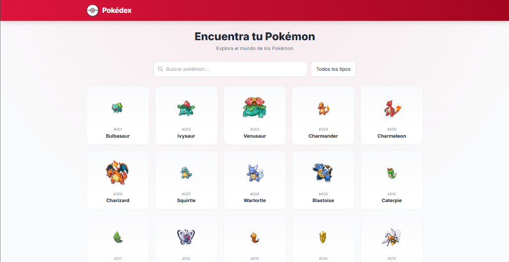
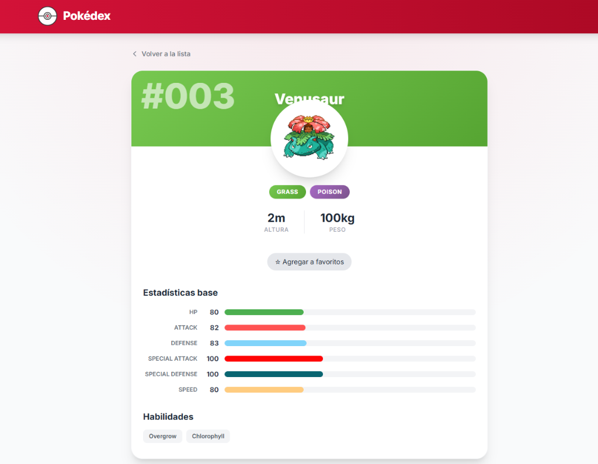
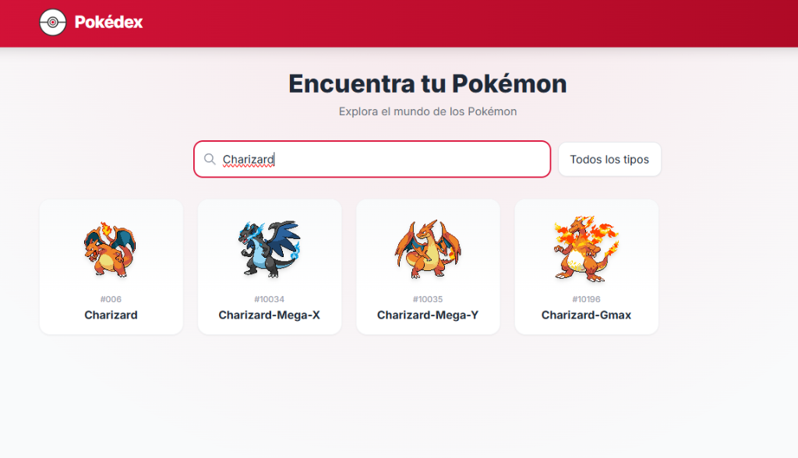

# Pokédex (Laravel + Livewire)


Una Pokédex interactiva que consume la PokeAPI en tiempo real. Construida con Laravel 13, Livewire 4 y estilizada con TailwindCSS.

## Características

- Búsqueda en tiempo real.
- Filtros por tipo de Pokémon.
- Paginación avanzada con opción de saltar a una página específica.
- Detalles del Pokémon con estadísticas base, habilidades, peso, altura y descripción en español.
- Sistema de favoritos asociado al usuario (si está autenticado) o a la sesión del visitante.
- Optimización de peticiones con caché de 24 horas en las consultas a la PokeAPI.

## Capturas de pantalla

### Vista principal / Lista


### Detalle de Pokémon


### Búsqueda de Pokémon


## Instalación

1. Clonar el repositorio:
   ```bash
   git clone https://github.com/jhannlozano934-hub/pokeDex.git
   cd pokeDex
   ```

2. Instalar las dependencias de Composer:
   ```bash
   composer install
   ```

3. Configurar el entorno:
   ```bash
   cp .env.example .env
   php artisan key:generate
   ```

   *Nota: Configura las credenciales de tu base de datos en el archivo `.env`.*

4. Ejecutar las migraciones:
   ```bash
   php artisan migrate
   ```

5. Levantar el servidor:
   ```bash
   php artisan serve
   ```
